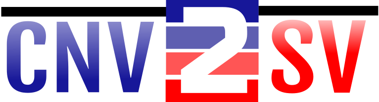

#  

## Goal
  
The root cause of the copy number variations is from the underlying genome structure changes. Most detection methods / technologies only take care about whether there are additional copies or missing at one particular locus.  In the light of better DNA detection / sequencing technology, it is possible to construct a full picture of a genome. We would like to address the missing links from CNV detection to the full genome sequence information. In the future, this may help to understand whether the detailed information, e.g. breaking points, of the additional or missing copies are indeed important as makers for pathogenic effects.

## Usage

Required input for CNV2SV linking:

* SV and CNV calls in BED or VCF formats (from Parliament2, Control-FREEC, and dipcall)

Required Python (3.8.\*) packages for CNV2SV linking:

* intervaltree
* biopython
* samtools

Recommended usage (via DNAnexus):

* Read alignments in BAM format for processing with Parliament2
* Genome assembly in FASTA format for processing with dipcall

Additional dependencies:

* Control-FREEC (provides CNV calls from short read data, requires per chromosome reference FASTA)

## Aims

We will focus on a couple of genomes that have data from various sequencing technologies where the best genome assemblies and short reads are easy to get. The first target is the T2T2 CHM13. While it is a haploid genome and it will not reflect the "real world" use cases, it will simplify the "equation" so we can develop methods before jumping into a jungle where the information is too complicated to analyze initially.  

The general idea is straight-forward. We will detect CNV using short read data. The alignments and SV (not CNV) calls are straight forward, there are off-shelf solutions. (Yih-chii, Chai and I from DNAnexus has done some preliminary work in the last couple days, so we have some jump-start first without dealing with those long alignment computation tasks.) 

### Aim1

figure out the right way to call CNV from a germline only WGS data. It seems to me most CNV code in the market is using normal-tumor pairs for calling CNV or only focusing on exomes. We need to find useful tools for germline WGS or come up with some quick way to reanalyze the SVs or variant calls (e.g. het-variant call from CHM13) to identify CNV candidates.

### Aim2 

With the CNV candidates called on GRCh38, we will need to find a mapping / liftover, or quick ad-hoc alignment using existing tools to get the sequences from a CHM13 assembly.

### Aim3 

Make some visualization of the identified CNV, potentially focus on pathogenic alleles.

### Aim4

Explore the infrastructure for automation of these processes and make a gallery all related to CNV / SV for demonstration.

## Methods

<!--- ## Awesome Logo -->

Overview Diagram

<!---
# Software Workflow Diagram
-->

### CNV/SV calling from short read data

We are using Parliament for SV/CNV calls from the short read data. We rely on both CNVnator individual calls and combined calls to get the potential duplication locations. Additionally we also run Control-FREEC to estimate the copy number for different regions of the genome based on the short read data. The Control-FREEC output is converted into BED and VCF files for downstream processing.

### Assembly alignment and SV calling

We use the draft assembly of CHM13 T2T genome. We align it to the reference GRCh38 human genome using dipcall, by building a simulated diploid genome via using two copies of CHM13. We then construct dot plots of the alignment to identify potential regions of interest, and extarct a VCF for downstream processing.

### CNV/SV linking

Moritz Smolka has developed a Python script for merging short read and assembly based CNV/SV calls to locate regions in which the duplication events overlap. We are currently working on additional visualization scripts for the final product.

## Results

### CNVlink raw output

Here, an example for the raw output (CNV - SNV links) produced by cnvlink.py is shown. Upcoming work includes visualizing key elements from these raw data.

### CNV/SV linkage information plot

The figures below shows linked CNV calls (from CNVnator) and respective SV insertion calls. The site of the CNV call corresponds to the wider end of a chord, and the insertion SV corresponds to the narrower end. First figure shows the best match used for linking, while the second figure shows all potential SV matches that have the alignment identiity of at least 80%.

